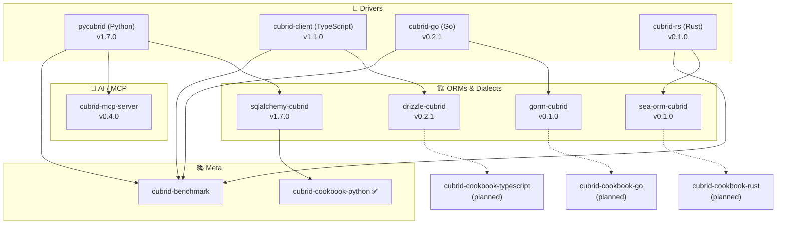
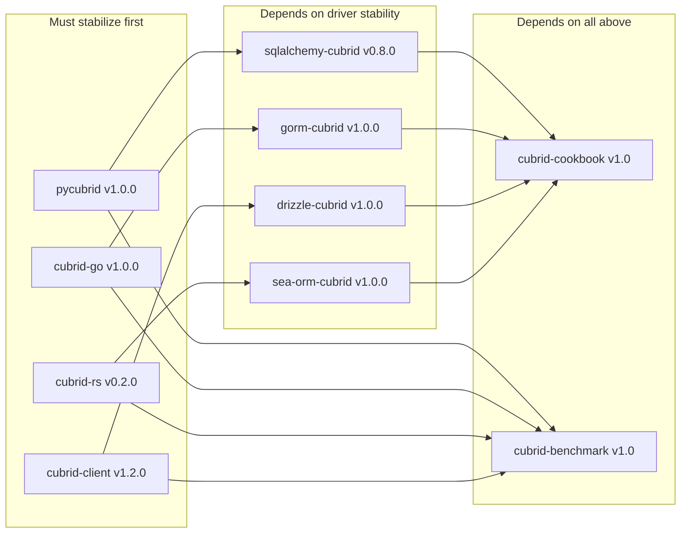

# CUBRID Labs — Ecosystem Roadmap

> **Last updated**: 2026-09-12
>
> This is the unified roadmap for the cubrid-lab ecosystem.
> Milestones are authoritative for "next release" scope.
> This document is authoritative for direction, priorities, and cross-repo dependencies.
>
> 📋 [**Org Project Board**](https://github.com/orgs/cubrid-lab/projects/2) (maintainers only) · See [individual repo milestones](#release-focus-by-repo) for execution details.

---

## Ecosystem Map

---

## Now / Next / Later

### 🟢 Now (Current Focus)

- **cubrid-cookbook-python ✅ COMPLETE** — 75 examples (7 templates including AI agent), 45 CI golden-verified on **CUBRID 11.2 + 11.4 matrix**. [Support Matrix](https://github.com/cubrid-lab/cubrid-cookbook-python/blob/main/SUPPORT_MATRIX.md)
- **cubrid-mcp-server v0.4.0 ✅ RELEASED** — 12 tools, 5 domain-knowledge resources (agent skills), 9 prompts (5 expert workflows), read-only whitelist, opt-in write mode, multi-connection, audit logging, SBOM on releases. fastmcp pin opened to `<5` (canary 3x green). Docs site live.
- **Python ecosystem v1.7.0 stable** — pycubrid + sqlalchemy-cubrid both at v1.7.0 on PyPI. Native ENUM support (#343), `IS [NOT] DISTINCT FROM` emulation via `<=>` (#344). SQLAlchemy official test suite integrated. 1,916 total tests, 20-combination CI matrix, cross-platform (Ubuntu + macOS).
- **Documentation & internationalization** — 4 docs sites (six-tab unified IA), 33 Korean documentation pages, 5-language READMEs on pycubrid/sqlalchemy-cubrid. Translation sync CI with Korean hard gate.
- **Governance** — Label taxonomy with weekly drift audit, translation-sync CI, operations manual, demo GIFs on all READMEs, SBOM + THIRD_PARTY_LICENSES on every repo.
### 🟡 Next (1–3 Months)

- **cubrid-mcp-server PyPI publish** — GitHub Release shipped with SBOM; PyPI publish pending Pending-Publisher registration (#154). After publish: MCP Registry listing, Glama, mcp.so.
- **CUBRID 12 support** — Track upstream release; test drivers against CUBRID 12 when available.
- **Vector types (cubvec)** — Server `cubvec` branch analyzed (wire format, type codes, HNSW). Prototype behind experimental flag once server releases.
- **Windows CI** — macOS + Linux active; Windows offline tests planned (pure Python, no technical blocker).
- **Language-specific cookbooks** — TypeScript, Go, Rust following the Python cookbook pattern.
- **v1.0 stabilization** — API freeze for cubrid-go, gorm-cubrid, drizzle-cubrid.
- **Connection resilience** — Retry policies, connection health checks (cubrid-client v1.2.0).
- **Registry publishing** — crates.io (cubrid-rs, sea-orm-cubrid); PyPI Trusted Publisher configured for pycubrid/sqlalchemy-cubrid.
### 🔵 Later (3–6 Months)

- **Hosted MCP (Streamable HTTP)** — Docker image for team/remote deployment scenarios; fastmcp supports `transport="http"`.
- **Connection pool crates** — cubrid-pool for Rust (cubrid-rs v0.6.0).
- **Full SeaORM feature parity** — Entity generation, migrations, crates.io availability.
- **Ecosystem documentation portal** — Unified docs site (GitHub Pages).

## Dependency Graph

---

## Release Focus by Repo

| Repo | Next Milestone | Focus | Link |
|------|---------------|-------|------|
| **pycubrid** | v1.7.0 ✅ | Pure Python, asyncio+TLS, 1,147 tests, 95% coverage, cross-platform CI (Ubuntu+macOS), 35 PyPI releases, demo GIF | [Releases](https://github.com/cubrid-lab/pycubrid/releases) |
| **pycubrid** | [v2.0.0](https://github.com/cubrid-lab/pycubrid/milestone/1) | Next major — connection pooling, breaking changes deferred from 1.x | [Milestones](https://github.com/cubrid-lab/pycubrid/milestones) |
| **sqlalchemy-cubrid** | v1.7.0 ✅ | SQLAlchemy 2.0–2.2, native ENUM (#343), IS DISTINCT FROM (#344), 769 tests, official SA test suite, 19 PyPI releases | [Releases](https://github.com/cubrid-lab/sqlalchemy-cubrid/releases) |
| **sqlalchemy-cubrid** | [v2.0.0](https://github.com/cubrid-lab/sqlalchemy-cubrid/milestone/2) | SA 2.2 full GA support, JSON type mapping | [Milestones](https://github.com/cubrid-lab/sqlalchemy-cubrid/milestones) |
| **cubrid-client** | [v1.2.0](https://github.com/cubrid-lab/cubrid-client/milestone/1) | Reliability & performance | [Milestones](https://github.com/cubrid-lab/cubrid-client/milestones) |
| **drizzle-cubrid** | [v1.0.0](https://github.com/cubrid-lab/drizzle-cubrid/milestone/1) | Stable release | [Milestones](https://github.com/cubrid-lab/drizzle-cubrid/milestones) |
| **cubrid-go** | [v1.0.0](https://github.com/cubrid-lab/cubrid-go/milestone/1) | Stable release | [Milestones](https://github.com/cubrid-lab/cubrid-go/milestones) |
| **gorm-cubrid** | [v1.0.0](https://github.com/cubrid-lab/gorm-cubrid/milestone/1) | Stable release | [Milestones](https://github.com/cubrid-lab/gorm-cubrid/milestones) |
| **cubrid-rs** | [v0.2.0](https://github.com/cubrid-lab/cubrid-rs/milestone/1) | Protocol completeness | [Milestones](https://github.com/cubrid-lab/cubrid-rs/milestones) |
| **cubrid-rs** | [v1.0.0](https://github.com/cubrid-lab/cubrid-rs/milestone/2) | Stable release | [Milestones](https://github.com/cubrid-lab/cubrid-rs/milestones) |
| **sea-orm-cubrid** | [v1.0.0](https://github.com/cubrid-lab/sea-orm-cubrid/milestone/1) | Stable release | [Milestones](https://github.com/cubrid-lab/sea-orm-cubrid/milestones) |
| **cubrid-cookbook-python** | ✅ Complete | 75 examples (7 templates incl. AI agent), 45 CI golden-verified 11.2+11.4, one-command dashboard, demo GIFs | [Repo](https://github.com/cubrid-lab/cubrid-cookbook-python) |
| **cubrid-mcp-server** | v0.4.0 ✅ | 12 tools + 5 skill resources + 9 prompts, read-only whitelist, multi-connection, SBOM; fastmcp `<5`; PyPI pending registration (#154) | [Releases](https://github.com/cubrid-lab/cubrid-mcp-server/releases) |
| **cubrid-benchmark** | [v1.0](https://github.com/cubrid-lab/cubrid-benchmark/milestone/1) | Comprehensive benchmarks | [Milestones](https://github.com/cubrid-lab/cubrid-benchmark/milestones) |

---

## Contributing

We welcome contributions to any repo in the ecosystem!

- 🐛 **Found a bug?** Open an issue on the relevant repo
- 💡 **Have a feature idea?** Start a [Discussion](https://github.com/orgs/cubrid-lab/discussions)
- 🔧 **Want to contribute code?** See [CONTRIBUTING.md](CONTRIBUTING.md) and look for `good first issue` labels
- 📋 **Track progress**: [Org Project Board](https://github.com/orgs/cubrid-lab/projects/2) (maintainers only)

---

> **Disclaimer**: This roadmap reflects current intentions and priorities. Timelines and scope may change based on community feedback, contributor availability, and technical discoveries. Milestones on individual repos are the most up-to-date source for release planning.
